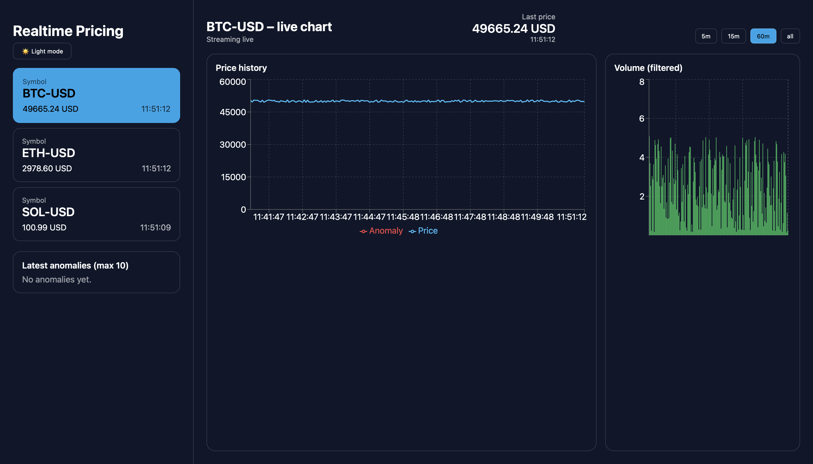
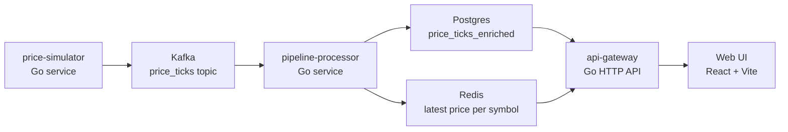

# Realtime Pricing Platform
En modern realtidsplattform för prisdata baserad på Go, Kafka, Postgres, Redis, Kubernetes och en React-dashboard.
---
# Screenshots


---

# Overview
Realtime Pricing Platform är ett fullstack-streamingprojekt byggt för att demonstrera moderna data engineering-principer: event streaming, realtidshantering, mikrotjänster, containeriserad infrastruktur och en webb-baserad dashboard.
Systemet genererar simulerad prisdata, publicerar den till Kafka, processar händelserna i en Go-baserad pipeline, lagrar historik i Postgres och senaste pris i Redis. En API-gateway tillhandahåller REST-endpoints som konsumteras av en React-applikation.
Projektet är utformat som en produktionliknande mini-stack och lämpar sig väl som portfolio-material för roller inom data engineering, backend eller DevOps.
---
# Architecture Overview


# Tech Stack
| Layer           | Tech                                         |
|----------------|----------------------------------------------|
| Languages      | Go, JavaScript (React)                       |
| Streaming      | Kafka, Zookeeper                             |
| DB / Cache     | Postgres, Redis                              |
| Backend        | Go services (simulator, processor, gateway)  |
| Frontend       | React + Vite, Recharts                       |
| Infra          | Docker Compose, Kubernetes manifests          |
| DevOps         | K8s resources, ConfigMap/Secrets, Ingress    |


# Getting Started (Local – Docker Compose)

1. Klona repo
```bash
git clone https://github.com/hampusjohansson-data/realtime-pricing-platform
cd realtime-pricing-platform
```

2. Starta hela stacken
```bash
docker-compose up --build
```

3. Tjänster och portar
| Service                | URL / Port            |
|------------------------|-----------------------|
| Frontend (Web UI)      | http://localhost:5173 |
| API Gateway            | http://localhost:8080 |
| Kafka Broker           | localhost:9092        |
| Kafka UI (om aktiverad)| http://localhost:8081 |
| Postgres               | localhost:5432        |
| Redis                  | localhost:6379        |

4. Dashboard
Web UI visar:
Realtidspriser (hämtas från Redis via API Gateway)
Historiska grafer (Postgres via API Gateway)
Volym och andra mätvärden.
---

# Running in Kubernetes (minikube / kind)
1. Skapa namespace
```bash
kubectl apply -f infra/k8s/namespace.yaml
```
2. Applicera ConfigMaps
```bash
kubectl apply -f infra/k8s/configmap.yaml
```
3. Skapa och applicera secrets
```bash
cp infra/k8s/secrets.example.yaml infra/k8s/secrets.yaml
# Fyll i riktiga värden
kubectl apply -f infra/k8s/secrets.yaml
```
4. Deploya stacken
```bash
kubectl apply -f infra/k8s/
```
5. Exponera frontend i minikube
```bash
minikube service web-ui-service -n pricing
``` 
Nästa steg förklarar data flow.

---

# Data Flow
1. price-simulator genererar simulerade pris-ticks
2. Publicerar till Kafka-topic price_ticks
3. pipeline-processor konsumerar och berikar data
4. pipeline-processor skriver:
5. senaste pris per symbol till Redis
6. fullständig historik till Postgres
7. API Gateway exponerar REST-endpoints
8. Web UI hämtar data från API:t och presenterar realtidsvy och grafer.

---


# Security & Secret Management
* Riktiga secrets finns inte i Git-repot
* Endast secrets.example.yaml och exempel på .env finns i källkoden
* .gitignore förhindrar att riktiga kube-secrets, .env, infra/env/* och node_modules/ inkluderas
* I Kubernetes används Secrets och ConfigMaps med environment variables i respektive deployment
* Struktur följer 12-factor-principer för konfighantering

# Future Improvements
**Funktionella förbättringar**
* Anomaly detection, glidande medelvärden, larm
* WebSocket-basera realtid i stället för polling
* Stöd för fler symboler och fler marknader
* UI-funktioner för filter, tidsintervall och aggregation

**Engineering-fokuserade förbättringar** 
* Enhetstester i Go
* Frontend-tester med Vitest/React Testing Library
* GitHub Actions baserad CI/CD
* Prometheus-metrics och Grafana dashboards
* Strukturerad loggning (JSON) och förbättrad observability
* Helm chart för enklare deployment
* Förbättrad konfigurationshantering

# Roadmap

**Version 1.1 – Snabba vinster**
Grundläggande Go-enhetstester
GitHub Actions för testning och byggsteg
Förbättrad konfigurationsstruktur (env vars)
Dokumentation av API-endpoints

**Version 1.2 – Funktionella iterationer**
WebSocket-stöd i API Gateway
UI-filter och förbättrade grafer
Moving average och anomaly detection i pipeline-processor
Grafana-dashboard för realtidsmonitorering

**Version 2.0 – Produktionliknande utbyggnad**
Helm charts
E2E-testmiljö i CI med kind
Horizontal Pod Autoscaler (HPA)
OpenTelemetry-tracing
Förbättrad secrets-hantering (t.ex. SOPS eller Vault)